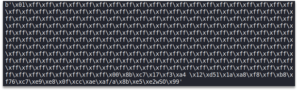
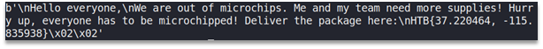

# Baby rebellion

We were given 3 RSA public keys in forms of certificates and S/MIME encrypted email messages. Our S/MIME encrypted message among other things consists of:
•	AES session key encrypted with 3 RSA public keys we are given. One time for each recipient.
•	AES IV (encryption mode is CBC).
•	Message encrypted with AES session key.
So normally you would decrypt the AES session key with RSA private key, but we do not have any.
Looking at the public keys we can notice that all 3 public keys have the same public exponent: e = 3. And since we have the same plaintext (session key) encrypted multiple times using the same low public exponent, we can use broadcast attack to recover the plaintext.
In our case broadcast attack consists of using CRT on moduli and ciphertexts and then extracting cube root from the result of CRT.
Using broadcast attack yields us an AES session key padded with PKCS1-v1_5 padding. This can be seen on the Figure 1.



Figure 1 – AES session key padded with PKCS1-v1_5 padding

To unpad it, we simply cut off everything except the last 32 bytes. Last 32 bytes are our AES session key.
Then we decrypt the main message using recovered AES key using the following code and get the flag, as can be seen on the Figure 2.

```python
from asn1crypto import cms, util, x509, pem
from sympy.ntheory.modular import crt
from sympy.functions.elementary.miscellaneous import cbrt
from Crypto.Util.number import *
from Crypto.Cipher import AES
data = open('msg.der', 'rb').read()
info = cms.ContentInfo.load(data)
enveloped_data = info['content']
encrypted_content_info = enveloped_data['encrypted_content_info']
enc_flag = encrypted_content_info['encrypted_content'].native
aes_iv = encrypted_content_info['content_encryption_algorithm']['parameters'].native
rec_data = {
    'mechi@cyb.org':{},
    'corius@cyb.org':{},
    'andromeda@cyb.org':{}
}
for recipient in enveloped_data['recipient_infos']:
    rec_mail = recipient.chosen['rid'].native['issuer']['email_address']
    rec_data[rec_mail]['enc_key'] = recipient.chosen['encrypted_key'].native
print(aes_iv)
mechi_pem = open('mechi.crt', 'rb').read()
if pem.detect(mechi_pem):
    _, _, mechi_der = pem.unarmor(mechi_pem)
mechi_crt = x509.Certificate.load(mechi_der)
rec_data['mechi@cyb.org']['n'] = mechi_crt['tbs_certificate']['subject_public_key_info']['public_key'].native['modulus']
print(mechi_crt['tbs_certificate']['subject_public_key_info']['public_key'].native)
cor_pem = open('corius.crt', 'rb').read()
if pem.detect(cor_pem):
    _, _, cor_der = pem.unarmor(cor_pem)
cor_crt = x509.Certificate.load(cor_der)
rec_data['corius@cyb.org']['n'] = cor_crt['tbs_certificate']['subject_public_key_info']['public_key'].native['modulus']
print(cor_crt['tbs_certificate']['subject_public_key_info']['public_key'].native)
andr_pem = open('andromeda.crt', 'rb').read()
if pem.detect(andr_pem):
    _, _, andr_der = pem.unarmor(andr_pem)
andr_crt = x509.Certificate.load(andr_der)
rec_data['andromeda@cyb.org']['n'] = andr_crt['tbs_certificate']['subject_public_key_info']['public_key'].native['modulus']
print(andr_crt['tbs_certificate']['subject_public_key_info']['public_key'].native)
ns, cs = [], []
for v in rec_data.values():
    ns.append(v['n'])
    cs.append(bytes_to_long(v['enc_key']))
x = crt(ns, cs)[0]
m = cbrt(x)
aes_key = long_to_bytes(m)
print(pow(m, 3, ns[0]) == cs[0])
print(len(aes_key))
aes_key = aes_key[-32:]
cipher = AES.new(aes_key, AES.MODE_CBC, aes_iv)
mb_flag = cipher.decrypt(enc_flag)
print(mb_flag)
```



Figure 2 – The exploit output

Flag: HTB{37.220464, -115.835938}