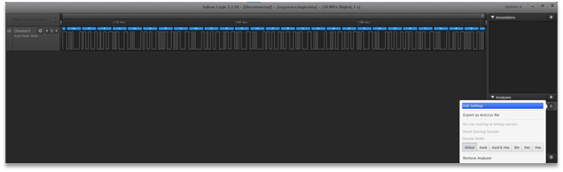
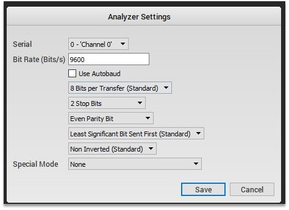
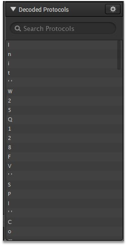

# Block

We see 2 files in the task folder: sequence.logicdata and dump.bin.
We googled the first file extension and found that it can be opened with a saleae logic tool. This tool and loaded file can be seen on the Figure 1.



Figure 1 – Saleae logic and loaded into this program file sequence.logicdata

Using the settings from Figure 2, we were able to decode a message from trafic. On the Figure 3 a message can be seen.



Figure 2 – Analyzer settings



Figure 3 – Decoded message

The resulting message looks like this:

```
Init' 'W25Q128FV' 'SPI' 'Comm..xy' 'sector:xCOMM' 'page:yCOMM' 'page_offset:xy 14 17 27 11 04 15 19 40 21 51 18 06 49 02 31 50 28 41 32 35 24 39 42 36 45 03 43 20 00 01 09 44 38 07 22 08 13 23 37 10 47 05 33 26 46 25
```

We exported the data and puts it into Python script. The task description says that 16 sectors are present in the memory dump. The title of the device is W25Q128FV, we googled it, and revealed the page size is equals to 256 bytes. The dump is 65536 bytes long. So, we can analyze the transmission: each byte offset can be calculated as 4096x (sectors), + 256y (pages) + xy.

```Python
data = "14\r\n17\r\n27\r\n11\r\n04\r\n15\r\n19\r\n40\r\n21\r\n51\r\n18\r\n06\r\n49\r\n02\r\n31\r\n50\r\n28\r\n41\r\n32\r\n35\r\n24\r\n39\r\n42\r\n36\r\n45\r\n03\r\n43\r\n20\r\n00\r\n01\r\n09\r\n44\r\n38\r\n07\r\n22\r\n08\r\n13\r\n23\r\n37\r\n10\r\n47\r\n05\r\n33\r\n26\r\n46\r\n25".split('\r\n')
b = open('dump.bin', 'rb').read()
for i in data:
   print(chr(b[int(i[0])*4096+int(i[1])*256+int(i)]), end='')
```

Flag: HTB{M3m0ry_5cR4mbl1N6_c4n7_54v3_y0u_th1S_t1M3}
