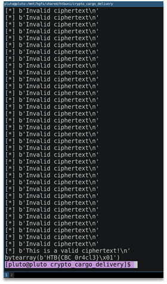

# Cargo delivery

There is given a server and its source code, from which we can get the encrypted flag. Also, it tells us if the padding for provided ciphertext is valid.
So, the first thing in mind is the padding oracle attack. We used an automated exploit for it and just wrote the transport. This exploit can be found by the following link: https://github.com/mwielgoszewski/python-paddingoracle.

```Python
from pwn import *
from paddingoracle import BadPaddingException, PaddingOracle
import json
from binascii import hexlify, unhexlify
from Crypto.Cipher import AES
class PadBuster(PaddingOracle):
    def __init__(self, **kwargs):
        super(PadBuster, self).__init__(**kwargs)
        self.io = remote("docker.hackthebox.eu", 30155)
        self.wait = kwargs.get('wait', 2.0)
    def get_encrypted_flag(self):
        self.io.recvuntil("2. Send your encrypted message.\n")
        self.io.sendline("1")
        return self.io.recvline()
    def oracle(self, data):
        while True:
            try:
                self.io.recvuntil("2. Send your encrypted message.\n")
                self.io.sendline("2")
                self.io.recvuntil("Enter your  ciphertext:\n")
                s = data
                s = hexlify(data)
                self.io.sendline(s)
                out = self.io.recvline()
                log.info(out)
                if b"Invalid ciphertext" in out:
                    raise BadPaddingException
                return
            except (socket.error, socket.gaierror, socket.herror, socket.timeout) as e:
                print(str(e))
if __name__ == '__main__':
    padbuster = PadBuster()
    data = unhexlify(padbuster.get_encrypted_flag().strip())
    print(data)
    iv = data[:AES.block_size]
    enc = data[AES.block_size:]
    print(iv)
    print(enc)
    dec = padbuster.decrypt(enc, block_size=AES.block_size, iv=iv)
    print(dec)
```

The result of the code execution can be seen on the Figure 1.



Figure 1 – The result of the code execution

Flag: HTB{CBC_0r4cl3}.
