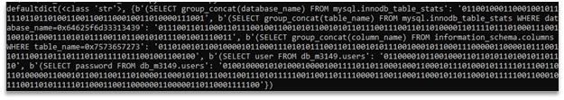

# Exfil

The task requires us retrieving the data gained by time-based blind sql injection. We extract the MySQL queries into the separate PCAP and run the following script:

```Python
from scapy.all import *
import re
payload = b"SELECT ASCII\(substr\(\(SELECT .*, \d\)\) >> \d & 1\) \* 3\)"
p = rdpcap("mysql.pcap")
known_patterns = dict()
for i in range(len(p)-1):
   pattern = re.search(payload, bytes(p[i][Raw]))
   if pattern:
       pattern = pattern.group(0)
   else:
       continue
   if pattern in known_patterns:
       known_patterns[pattern].append(p[i].time)
   else:
       known_patterns[pattern] = [p[i].time,]
exfils = defaultdict(str)
for pattern, timings in known_patterns.items():
   res = re.findall(b"substr\((.*)\), (.*),.*>> (.*) &", pattern)
   (query, position, bit) = res[0]
   delta = abs(timings[0] - timings[-1])
   if delta >= 2:
       exfils[query] += '1'
   else:
       exfils[query] += '0'
print(exfils)
```

Figure 1 shows the output of the script above.



Figure 1 – Output of the script

The last binary string decodes to HTB{b1t_sh1ft1ng_3xf1l_1s_c00l|, substitute the last symbol to get the flag.
Flag: HTB{b1t_sh1ft1ng_3xf1l_1s_c00l}
