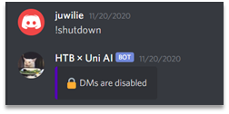
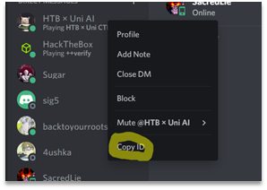
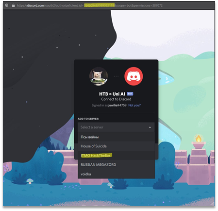
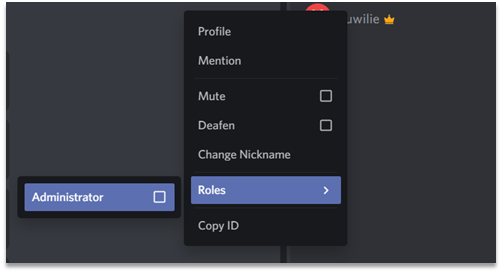
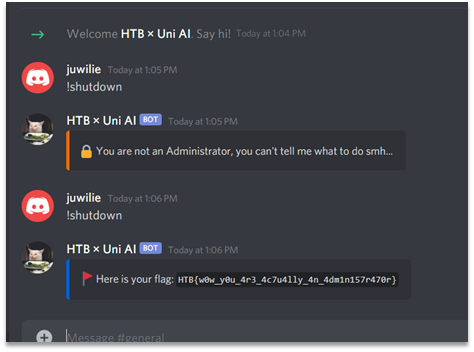

# HTBxUni AI

Bot is sitting in the HackTheBox server and responds only to the administrator. DMs are also disabled, as shown on the Figure 1.

Figure 1 – An attempt to communicate with a bot

To solve this challenge, we needed to add this bot to our server. To do so we should copy bot id (we can do that only if developer mode is enabled in Discord or in web version) as shown on the Figure 2.

Figure 2 – Extracting bot’s ID

Then we added bot using Discord’s OAUTH api: https://discord.com/oauth2/authorize?client_id=764609448089092119&scope=bot&permissions=387072. This can be seen on the Figure 3.
 

Figure 3 – Inviting bot to our discord server

Then we changed our role to Administrator to get flag, as shown on the Figure 4.

Figure 4 – Changing user role

And the bot can be deactivated. The result of “!shutdown” command can be seen on the Figure 5.

Figure 5 – Result of “!shutdown” command execution

Flag: HTB{w0w_y0u_4r3_4c7u4lly_4n_4dm1n157r470r}.
