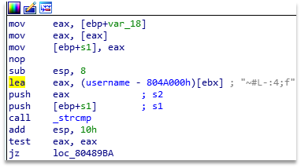
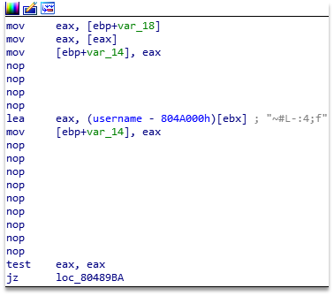
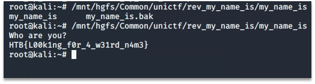

# Hi! My name is (what?)

The task can be solved by simple binary patching. The only check performed (in addition to anti-debugging check which also can be patched out), as can be seen on Figure 1, is the username.

Figure 1 – Checks in binary file

Since the name is not appropriate for linux user, it is easier to simply patch the binary, as can be seen on Figure 2.

Figure 2 – Binary patch

Running the binary after the patch reveals flag. The result of binary execution can be seen on the Figure 3.
 

Figure 3 – Result of binary execution

Flag: HTB{L00k1ng_f0r_4_w31rd_n4m3}.
