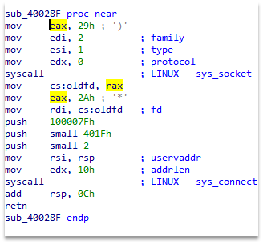
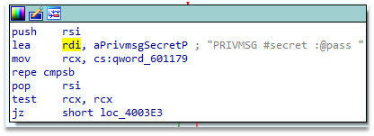

# Ircware

The binary tries to connect to port 0x1f40 locally, as seen on the Figure 18.

Figure 1 – Fragment of the binary with connection information

Then it is waiting for messages among which there is message for password. This can be seen on the Figure 2.

Figure 2 – Binary fragment with password input

Then the message “RJJ3DSCP” is decrypted to “ASS3MBLY” and this string is used as password. Input of this string as password reveals flag. The exploitation and the flag can be seen on the Figure 3.
 

Figure 3 – Exploitation and the result

Flag: HTB{m1N1m411st1C_fL4g_pR0v1d3r_b0T}.
