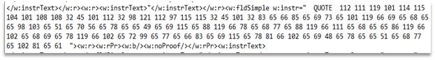

# KapKan

Opening invoice file in 7z and reading through its content reveals message in the UTF-8 char codes. This message can be seen at Figure 1.



Figure 1 – Encoded mesage

Translating decimal to UTF-8 gives us the following:
```
powershell -ep bypass -e SABUAEIAewBEADAAbgA3AF8ANAA1AEsAXwBNADMAXwBoADAAVwBfADEANwBfAHcAMABSAEsANQBfAE0ANAA3ADMAfQA=
```

The base64 part is equal to HTB{D0n7_45K_M3_h0W_17_w0RK5_M473}.
Flag: HTB{D0n7_45K_M3_h0W_17_w0RK5_M473}
