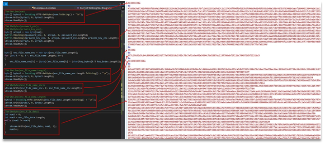

# Malception

First step is to extract the binary from PCAP.
While analyzing the binary file, we understand that the common cipher RC4 is used in the first phase of communication. RC4 usage can be seen on the Figure 1.

Figure 1 – Binary fragment with RC4 usage

The key for the cipher is a domain name, which can be spotted in other streams. As only 8 letters are used, it is MEGACORP.
Decoding the next stream and adding resources from the first binary gives us .NET payload with the same key. This can be seen at the Figure 2.
 

Figure 2 – .NET payload with the same key

This key is used to hide the RSA key. Decoding it gives us an opportunity to extract the final – AES-key, and decrypt the files transmitted. The transmitted files can be seen at the Figure 3.

Figure 3 – Transmitted files

First one contains a picture, the second one – a flag. This picture and the flag can be seen at the Figure 4.

Figure 4 – Decrypted picture and flag

Flag: HTB{m1nd_b3nd1ng_m@lwAr3!??}
