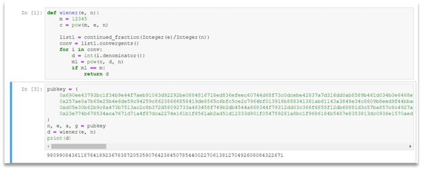
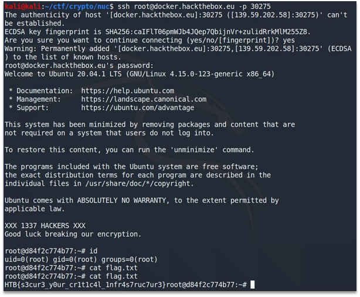

# Nuclear Disaster

In this task we were given the creds of ssh user. Connecting and looking at the files in the home directory we got the following challenge specifications:

```
n: 0x690ee43793bc1f34b9e44f7aeb91063d92292be0884816718ed836efeec60744d68f73c0dcebe42837a7d316dd0ab8589b461d034b0e6468e734b2b741c2ce7d50ca0e619114d758ff1973e57f843f22b0cb14af7694763a774f306c4f106616f173e2b4bdb49ef1cc2553c9dd3dc1877f7f87f106d01052faae22acfd6f3fbbfdb41be6192a0e49810a7c0874d634bcd07627e2a64f596e4356212f38628bb5416a6008e2ef0763a0da97475d7d5a1ee15842a4db54987b776f36120bf851b70c7edd197857297193c39c69d3cefe330029e57baae71f57a8fa3ffe3392855d7eca3861aa60eaabf93244b6659c9838680829eeba788dba871eedaf1f48e6ed00c1d5c12ace91edfab730d88180f2cab20beca486f73bb39ff73120a7d80c1a4bdfea3507009737977262a534a6513f4fb2db9a626f33d50a16f11098ada1d8f73043e616c298ce5bcc657120b83daa7e35263d0ff9dae602df9e00b1da0b0beacb00ee680ca890f8949f9ebd723c81eb789309a007301e6a621d431d367577
e: 0x257ae0a7b65e25b4e6de59c94259c86238666858419de8565c6bfc5ce2c7964bf013918b888341361ab61143a3848e34c8609b8eed9f44bbad6ec5c2e9c5d1fdcf79038a1fcb87aad9cae2cd885e2f42758b3ccc1efd37ebddc4462f86af68c199ae6015600077ddf6b8e2dfa5ce5b9701aebbd2d1385171c300a2823d72511f5663692b0c33c7d5ccdc9acd255a0ef7d644d94670a7af40a6829494e8a8371657b8b96618b4323030713b32c29b159ebddd7a0af42c64c63b5d92a8b8ff493b0418828206fbb5663d35d7d42d03e54b37e08f858296234d85d1eb72ad6fdff7115799c4901635cfd2ac83dda30b69fd9fbb9d1bddf38fd9c62e01776ab3c155d0e3fecefb7b9801e0cbc477b10dcd25f872c0f3172cdf05f27a17ea6d418f77bec591e1828b3830d35a3217cf59c7c384eee460579fff5d61f368bf453b142952456db7934d0063c0f46d9b5a8b35a7e7a4b211c532b7ce7ca5c09e45e241f87eaf63e0ecd35ece6275509c999415138daa6530297564e32b298ddaf62d87bf
a: 0xd05e30b62b9c8a473b7513ac2c8b372d58092733a463458f749b2db4544a868344f79312dd03c366f6855f12db68881d3c57ba857c8c4927a93e8e59569ba1c8eada720adcc818b8fb92c3e0b23ab26704d7859c16ef09c9d2692f0132295fa8a67e7936d1a7d53872c3a51e7115cb952c3ccbbfeb8d29c2f5b58ecdb799b423ebeca3725ff317682750610e5986b9c0fb385feacdbfda4082b8e820a7651e9569642d598c50050176019ade5ef446b5165b8280cf0c3f33efed0d13298aa6ab628669493d12bbbb6e80bc220b303874f0b4acd8a61319215fb44decae0c2f116e0710d3b022baeb6ee294206310e42dd51c1de91de872f1adf5c395a674cf05
g: 0x23e774b678534aca7671d71a4f87dca2274e161b1f8561ab2ad51d12333d901f054759281a8bc1f9686184b5487e8353813dc0938e1570aed83f34857744fbc5ea856687dcac06c53e3f9fc7e973cc94efb17ba85ecc00109e289b157172a0cad89ef4b6d795271e4e42aca26f0a0ee3cd71e2f561657fca7ddcb0fb45bb4d0491dca103cb5a4bfbbbf086bb58f73ae4f0fbd5fd8b2baf3606aca6937f0cd4a764be6ab44a014c6be5d2614a9de6c6548ce86588b7a3cff8e326429c9c2dcdd8595d9c5703f91c07b835721d5b59d9ba26e3f4d34f7e38a2d39602259cb024da307715f61a0c07ea4ce47eb19356109e4335820faa5b6e1f68fdcd4780c92a1c
c1: 0x48eeea8b6d8ee7b7264115858c883005b93a515db96c33329f22153b5646d771aee09fd5e34338640ddd3bb933e1eda111625f527725d3e3b8a7990560a4a50271fce090fcd1f525a9ddb5ceac20646afa5d383a84eab00c88fb6041899ebc1a6ce0b10a2fe00a7b6f7c0a23d6bb4c02237a4eaf7a8b8a748e1273a873d8b0b48526a6b96675163bd20d452050d530bd2cad6849a7087663a3aa3d11a2063716e4bd0279f1c369538d491b891301126310abb5b3b2ed1c2d4547fecd0feba29fa1a14b641e2cb5669cc6225a0f9c573ef3dd2a4b8f820afe63a639538d4dc52c1b76380ed3f6e9507c40f1a68412585acea0e5a8b5f00bfb15187ed84a65db1dba5e2c2a8234cc3acb15b354c3072e5f9e330f12aa6a323e4f98185050a161621fcaa6a0067697420c5a9509ed35724a623e36963fa80a5831d6925b2a89be18935147cfc2d390cbe39f3e44a4951f3a6c078c10d2c241c6e9a1e84188b36abee3c045d61325ba73b12c54844a2debf93d2d5374679f9aaa668278893e0ef65c
c2: 0xb9aa388ec95aa402d590ffd57ccb8cc1c741060cf4a33147ff5b030b8ab160d7475befb59a5221ab48a4567977f40ce5a60ec32ed35d21f05f3d9a3c4f0cc129f8bb71193cd14752e9b446132fca31402fc38d32b41b5cd98b8d56b03e360ab778158f2b529b95adcef7014fb7914958f73eb866232d58c06034c9050e94dd47bca4b43b7d3c9990171b68fced26ec22779a229cbd5d89b46110bfb17efcd68a6f786502a3e3e94dfac11b30108109ed331d2b3d69a70716d48420f0c1b43e954a09d1bf8a47f73360db789df6fdfc5ae360fc6d2d5952e41f1ce4def3ce2454007711c7c0fd4359c30fea7357e6ec1c5e61a42e908c0d01cb145795b44bf505
DROP US some ETH and you may prevent a nuclear disaster:
0x7b1cA37A0ad47B14e55a1E0d9d882999c0DF1Ee0
```

And the script to generate ciphertext and encryption parameters:

```Python
from Crypto.Util.number import *
from secret import root
def egcd(a, b):
    if a == 0:
        return (b, 0, 1)
    else:
        g, y, x = egcd(b % a, a)
        return (g, x - (b // a) * y, y)
def modinv(a, m):
    g, x, y = egcd(a, m)
    if g != 1:
        raise Exception('modular inverse does not exist')
    else:
        return x % m
def generate_keys(nbit):
    p, q, r = [ getPrime(nbit) for _ in range(3)]
    
    n = p * q * r
    
    phi = (p-1)*(q-1)*(r-1)
    
    d = getPrime(1 << 8)
    e = modinv(d, phi)
    a = getPrime(2*nbit)
    while True:
        g = getRandomRange(2, a)
        if pow(g, 2, a) != 1 and pow(g, a//2, a) != 1:
            break
    pub_key = (n, e, a, g)
    priv_key = (n, d, a, g)
    return pub_key, priv_key
def encrypt(m, pub_key):
    n, e, a, g = pub_key
    k = getRandomRange(2, a)
    K = pow(g, k, a)
    c1, c2 = pow(k, e, n), (m * K) % a
    return c1, c2
password = bytes_to_long(root)
pub_key, priv_key = generate_keys(1024)
c1, c2 = encrypt(password, pub_key)
f = open('your_last_hope.txt', 'w')
f.write('n: ' + hex(pub_key[0]) + '\n')
f.write('e: ' + hex(pub_key[1]) + '\n')
f.write('a: ' + hex(pub_key[2]) + '\n')
f.write('g: ' + hex(pub_key[3]) + '\n')
f.write('c1: ' + hex(c1) + '\n')
f.write('c2: ' + hex(c2) + '\n')
f.write('DROP US some ETH if you know what\'s good:\n0x7b1cA37A0ad47B14e55a1E0d9d882999c0DF1Ee0\n')
```

To recover private exponent, we used the Wiener attack. This can be seen on the Figure 1.



Figure 1 – Wiener attack result

Knowing private exponent, we recovered encrypted password, using the following code:

```Python
k = pow(c1, d, n)
K = pow(g, k, a)
print(k)
print(K)
print(c2 * inverse(K, a) % a)
ans = c2 * inverse(K, a) % a
print(long_to_bytes(ans))
```

Output:

```
18098846352876641578492621703637624880331428714424686905079101764592280181644093331462690938321592335495484058768969986728411732180570894837745788843183995991823246985343123757080453689951244276523557707327676313359080360775150903286956602511620785151099760705078150354238484251002460234677422962762641306586645834781909131060957678933575054034022557614103110299160082692908096510181005840971132055345278870368033899213507528994430973471900597376519334042400053352516006961034884209317276922080252147616983215686457848394323938861419149438518803049563805423884558690732547210203983368519592760615900150939921381832758
4053492215569828668269107800786425481562377574235838939015694156657899751403202646543157744199205620962570774636969170512021383182400775660020892051476451128344880184590067576167674689076021914088666776790392586671275161649215377032601990904701667864038043839360661893437135206453079737499498364319640266660271736188831773181114938009098796653196592489611009177492177964875944945473422368698169004091606317361059617209668433829729876174385937459981151405210455327742032966781976953852336668891927517060412308363350898889558421967311087999855034773011278504867799344889881695302195754619240397513302233468400643091997
4483715249980043692044294085480048514838642
b'3xtr4H34t1nr34ct0r'
```

At first, we did not exactly know what to do with recovered password. But then looking at the generator script we got that it is password from root user: “from secret import root”.
Then we used recovered password to connect as root and recovered the flag from flag.txt file. This can be seen on the Figure 2.



Figure 2 – Connecting to SSH as root user and displaying the flag

Flag: HTB{s3cur3_y0ur_cr1t1c4l_1nfr4s7ruc7ur3}.
