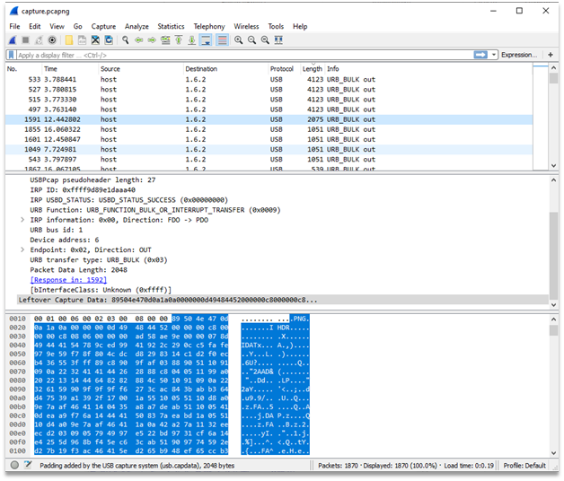
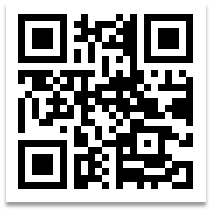

# Plug

Reading Leftover USB capture data reveals the following PNG structure. Part of the PNG file can be seen at the Figure 1.
This resource decodes to QR code image. This QR code can be seen at the Figure 2.
This QR code can be decoded to HTB{IN73R3S7iNG_Us8_s7UFf}.

Figure 1 – Wireshark window with opened package, which contains PNG file 

Figure 2 – QR code from traffic

Flag: HTB{IN73R3S7iNG_Us8_s7UFf}.
