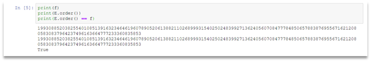

# Signal from outer space

We are given an elliptic curve equation, group generator (ISS Coordinates as Reference Point), and public key P = G*x (Miscalculated Source Point), and the encrypted flag using AES.
The actual key for AES is sha1((P*x).x), so to recover this we need to solve ECDLP.
We can note that the group order is equal to the number of elements in the field. This can be seen on the Figure 1.
 


Figure 1 – Screenshot from Jupiter Notebook

Hence, we can use Smart attack on anomalous curves to solve ECDLP. 
The description of this attac can be found by the following link:  https://wstein.org/edu/2010/414/projects/novotney.pdf and the exploit can be found here: https://github.com/kabachook/ecc/blob/master/ecc/tasks/anomalous/algo.py 
After decrypting we get an mp3 file, the flag itself is being pronounced.
The final exploit:

```Python
import hashlib
from Crypto.Cipher import AES
from typing import Union
from sage.all import *
from sage.schemes.elliptic_curves.ell_point import *
def hensel_lift(P: EllipticCurvePoint, p: Integer, prec: Union[None, Integer]) -> EllipticCurvePoint:
    E = P.curve()
    Eq = E.change_ring(QQ)
    Ep = Eq.change_ring(Qp(p, prec))
    x_P, y_P = P.xy()
    x_lift = ZZ(x_P)
    y_lift = ZZ(y_P)
    y = var('y')
    a1, a2, a3, a4, a6, x = ZZ(Eq.a1()), ZZ(Eq.a2()), ZZ(
        Eq.a3()), ZZ(Eq.a4()), ZZ(Eq.a6()), ZZ(x_P)
    g = y**2 + a1*x*y + a3*y - x**3 - a2*x**2 - a4*x - a6
    gDiff = g.diff()
    for i in range(1, prec):
        uInv = ZZ(gDiff(y=y_lift))
        u = uInv.inverse_mod(p ^ i)
        y_lift = y_lift - u*g(y_lift)
        y_lift = ZZ(Mod(y_lift, p ^ (i+1)))
    y_lift = y_lift+O(p ^ prec)
    return Ep([x_lift, y_lift])
def smart_attack(P: EllipticCurvePoint, Q: EllipticCurvePoint,  p: Integer, prec: Union[None, Integer]) -> Integer:
    E = P.curve()
    Eqq = E.change_ring(QQ)
    Eqp = Eqq.change_ring(Qp(p, prec))
    P_Qp = hensel_lift(P, p, prec)
    Q_Qp = hensel_lift(Q, p, prec)
    p_times_P = p*P_Qp
    p_times_Q = p*Q_Qp
    x_P, y_P = p_times_P.xy()
    x_Q, y_Q = p_times_Q.xy()
    phi_P = -(x_P/y_P)
    phi_Q = -(x_Q/y_Q)
    k = phi_Q/phi_P
    k = Mod(k, p)
    return k
f = 19930885203825540108513916323464619607890520613882110268999315402502483992713624056070847778485065788387695567162120805830837964237496163664777233360835853
F = GF(19930885203825540108513916323464619607890520613882110268999315402502483992713624056070847778485065788387695567162120805830837964237496163664777233360835853)
E = EllipticCurve(F, [F(16964108867870875431022511847406074513505438269132199629926447105117327702973321429130078673611996313382775579316996202239740533714013559789369433905598853), F(
    2557269903904682970099236538031735218462780844817175317697385659377007186785050969676938059088155922328011075081606354569621958862612850816694647002380820)])
print(E)
Gx = F(11612316038801479962400723698427883310130163176291338759911281034170556609743457773032375965620429931675410389220512342834663089126659445523701533922313238)
Gy = F(14492470559976609909614920150302533890662281539874542639808213982956316710837667114681496336361906718748053884513468343236055545337522055713141076615967243)
G = E((Gx, Gy))
print(G)
Px = F(716447455218443211337138354910360820310039222467099750548875601978669948877653369670984450493776038314939273990792875030477209738905138162016103972822887)
Py = F(2577636835404844606086593513656242872409629115084680797009677298030035019056074660428408865132307063442440986937998752115629728860272800311376841076830297)
P = E((Px, Py))
print(P)
print(f)
print(E.order())
print(E.order() == F)
d = smart_attack(G, P, f, 8)
print(d)
PP = G * 11568228948033756316880439309350939673466728751800247616290793327983726097204440941777542891811676682980936787973145438110219254450479902147897654728360094
PP = PP * 11568228948033756316880439309350939673466728751800247616290793327983726097204440941777542891811676682980936787973145438110219254450479902147897654728360094
print(PP.xy()[0])
x = PP.xy()[0]
sha1 = hashlib.sha1()
sha1.update(x)
key = sha1.digest()[:16]
enc = open('flag.enc', 'rb').read()
cipher = AES.new(key, AES.MODE_ECB)
dec = cipher.decrypt(enc)
open('flag.mp3', 'wb').write(dec)
```

Flag: HTB{37_c0m3_h0m3_d1nn3r_15_r34dy}.