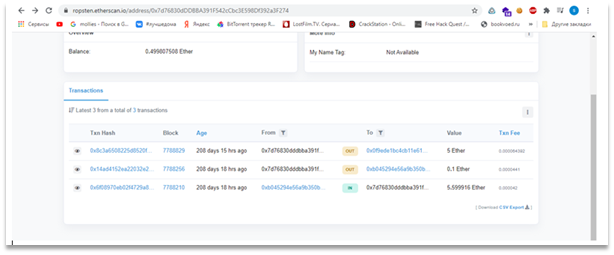

# Warren Buffer

In WarrenBuffer.pcap we saw some HTTP-requests. Examined those requests in HTTP-streams and we saw that those requests differ from each other by last 2 symbols in User-Agent header. On the Figure 1 example of HTTP-stream can be seen, and the Figure 31 reveals the difference between every User-Agent, 

Figure 1 – Example of HTTP-stream

Figure 2 – Difference between every User-Agent

These symbols are hex bytes. We converted it to ASCII text and get the following link: https://ghostbin.co/paste/yqtsek93, but this web-resource requires a password. A password is in last HTTP-stream. This stream can be seen on the Figure 3.

Figure 3 – HTTP-stream that contains password

Enter password and get a paste content, which is base64 encoded data. This data can be converted to JPEG image. The decoded picture is shown on the Figure 4. 

Figure 4 – Base64-decode picture

The interesting part on this picture is a block with text “My bytes are washed by 7d76830dDDBBA391F542cCbc3E598Df392a3F274”.
7d76830dDDBBA391F542cCbc3E598Df392a3F274 – looks like an address in Ethereum blockchain. There is no such address in real Ethereum network, but there is in a test network Ropsten. Blockchain explorer is shown on the Figure 5.

Figure 5 – Blockchain explorer
One of the transactions has an interesting content, which can be seen on the Figure 6.

Figure 6 – Interesting input date in the transaction

In the receiver’s account (0x0f9ede1bc4cb11e614fa739df6e303f9ab19335d) transactions we can see a smart contract creation. The receivers’ transactions can be seen on the Figure 7 and the smart-contract creation is shown on the Figure 8.

Figure 7 – Receivers’ transactions

Figure 8 – Smart-contract creation

Field “input data” contains compiled smart contract. We use online decompiler https://ethervm.io/decompile and get disassembly of the contract. The disassembly is shown on the Figure 9.

Figure 9 – The smart-contract code

3 underlined strings on the figure above are hex values of the flag. After converting hex to ASCII, we got the flag.
Flag: HTB{1a4b20ec17323f20909c224614308f09}.
