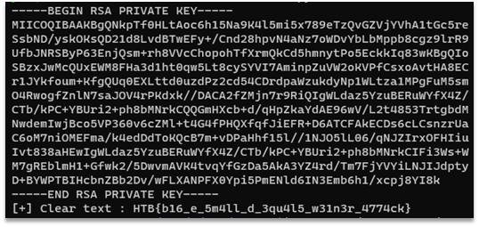

# Weak RSA

This task was solved using RsaCtfTool. 
If we run the following command, we will get the plaintext flag from the encrypted message:

```
python ~/RsaCtfTool/RsaCtfTool.py --publickey pubkey.pem --uncipherfile flag.enc --private
```

The output of this command and plaintext flag can be seen on the Figure 1.



Figure 1 – The output of this command and plaintext flag

Flag: HTB{b16_e_5m4ll_d_3qu4l5_w31n3r_4774ck}.
