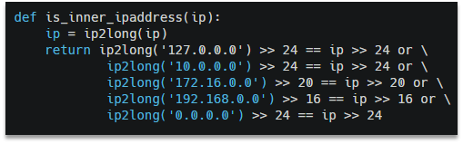
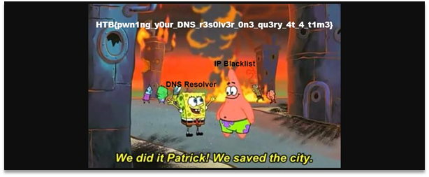

In this challenge we are required to bypass localhost check to get the flag. Those checks can be seen on the Figure 1.

Figure 1 – Localhost checks

As the service uses a browser to open the incoming links, we can create a redirect on our page, pointing to http://127.0.0.1:1337/flag and get the flag. We created a page on http://nghost.spbctf.com/red.php, got path to the screenshot and the flag itself. This screenshot can be seen on the Figure 2.

Figure 2 – Screenshot of received picture

Flag: HTB{pwn1ng_y0ur_DNS_r3s0lv3r_0n3_qu3ry_4t_4_t1m3}.
